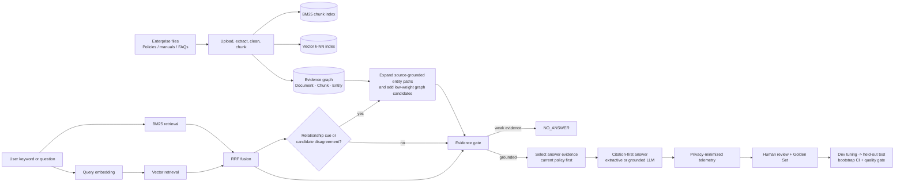

# Evidence-First Graph-Hybrid RAG

<p align="center">
  A reproducible RAG portfolio project for enterprise-file lookup.
</p>

<p align="center">
  <a href="https://github.com/GuZZ1119/rag-hybrid-retrieval-demo/actions/workflows/smoke.yml"></a>
  
  
  
  
</p>

<p align="center">
  <a href="#why-this-project">Why this project</a> &bull;
  <a href="#architecture">Architecture</a> &bull;
  <a href="#measured-results">Results</a> &bull;
  <a href="#quick-start">Quick start</a> &bull;
  <a href="docs/ARCHITECTURE.md">Design notes</a> &bull;
  <a href="docs/RESULTS.md">Full analysis</a>
</p>

> **Scenario:** An enterprise agent receives a keyword or question, searches uploaded policies, manuals, FAQs, or operating guides, and returns a source-grounded answer. The project is sanitized: no private documents, credentials, or internal business code are included.

## Why This Project

Most small RAG demos stop at “a vector search returned text.” This project treats RAG as an evidence system: exact policy wording, semantic similarity, cross-file relationships, document-version conflicts, citations, abstention, and measured regression are all part of the same loop.

| Goal | Implementation |
| --- | --- |
| Exact enterprise terms and identifiers | OpenSearch BM25 chunk retrieval |
| Paraphrases and semantic lookup | Local multilingual embedding model with OpenSearch k-NN |
| Cross-file logic | Conditional, source-grounded evidence graph |
| Stable hybrid ranking | Reciprocal Rank Fusion (RRF), not raw-score mixing |
| Answer safety | Evidence gate, `NO_ANSWER`, compact citation-first answers |
| Version conflicts | Current policy is selected before archived context |
| Continuous improvement | Frozen corpus and qrels, dev/test split, bootstrap CI, quality gate |

## Architecture



**Evidence responsibilities**

- **BM25** protects exact policy terms, codes, and formal wording.
- **Vector retrieval** handles paraphrases that do not share the same wording.
- **Evidence graph** is only used for relationship questions or BM25/vector disagreement. Every graph path resolves back to original chunks; graph edges never generate facts by themselves.
- **Answer evidence selection** returns at most two sources. For version conflicts it answers from the current controlled policy, then explains the archived evidence as historical context.

## Measured Results

The evaluation corpus is synthetic and anonymized, but the protocol is frozen and reproducible: **16 documents**, **68 labelled questions**, **21 dev / 47 held-out test** cases, deterministic chunk IDs, SHA-checked corpus manifest, and chunk-level qrels.

### Retrieval Comparison: Held-Out Test

| Path | Recall@5 | nDCG@5 | MRR@10 | Graph evidence coverage |
| --- | ---: | ---: | ---: | ---: |
| TEXT | 85.3% | 0.668 | 0.652 | 0.0% |
| VECTOR | 94.1% | 0.767 | 0.728 | 0.0% |
| HYBRID | **97.1%** | **0.793** | **0.760** | 0.0% |
| HYBRID+Graph | **97.1%** | **0.793** | **0.760** | 36.4% |

Graph expansion adds inspectable relationship evidence but did not improve ranking in this test set: its HYBRID comparison has a `0.000` delta and `[0.000, 0.000]` paired-bootstrap 95% intervals for Recall@5, nDCG@5, and MRR@10. That is reported as a limitation, not presented as a ranking gain.

### Answer-Evidence Improvement: Held-Out Test

The answer-selection configuration was chosen only on the dev split, then evaluated once on held-out test.

| Metric | Earlier baseline | Current result | Paired delta, 95% CI |
| --- | ---: | ---: | --- |
| Recall@5 | 97.1% | 97.1% | +0.000 [0.000, 0.000] |
| nDCG@5 | 0.793 | 0.793 | +0.000 [0.000, 0.000] |
| MRR@10 | 0.760 | 0.760 | +0.000 [0.000, 0.000] |
| Answer correctness | 54.4% | **85.3%** | +0.309 [+0.147, +0.485] |
| Citation correctness | 32.4% | **51.5%** | +0.191 [+0.162, +0.225] |
| Citation completeness | 89.7% | **95.6%** | +0.059 [+0.000, +0.147] |
| Negative no-answer rate | 0.0% | **53.8%** | +0.538 [+0.231, +0.769] |

`Answer correctness` is a deterministic reference-claim term metric, and extractive faithfulness verifies copied source evidence. They are not claims of production LLM semantic faithfulness. The complete method, failures, and report artifacts are in [docs/RESULTS.md](docs/RESULTS.md) and [eval/README.md](eval/README.md).

## What Is Included

- `POST /upload`: validated `.txt`, `.md`, `.pdf`, and `.docx` ingestion.
- `POST /index/rebuild`: deterministic text, vector, and graph index rebuild from uploaded files.
- `GET /search`: `TEXT`, `VECTOR`, and `HYBRID` paths with rank and score provenance.
- `POST /ask`: HYBRID retrieval, evidence gating, conditional graph expansion, answer evidence selection, citations, and safe fallback without an external LLM.
- `POST /feedback` and review queue: privacy-minimized feedback intake for manual Golden Set review.
- Isolated `kb-eval-api`: evaluation indexes and data volume cannot pollute the interactive demo.
- GitHub Actions smoke tests for API helpers, dataset validation, metrics, isolation, bootstrap, and gate logic.

## Quick Start

**Requirements:** Docker Desktop and Docker Compose v2. No local Python, Java, or database installation is required.

```bash
git clone https://github.com/GuZZ1119/rag-hybrid-retrieval-demo.git
cd rag-hybrid-retrieval-demo/demo
docker compose up -d --build
curl http://localhost:8080/health
```

Services:

| Service | Address | Purpose |
| --- | --- | --- |
| Demo API | `http://localhost:8080` | Upload, search, ask, feedback |
| Evaluation API | `http://localhost:8081` | Isolated frozen-corpus evaluation |
| OpenSearch | `http://localhost:9200` | Text, vector, and graph indexes |
| OpenSearch Dashboards | `http://localhost:5601` | Index inspection |

Upload, index, then query:

```bash
curl -F "file=@demo.txt" http://localhost:8080/upload
curl -X POST http://localhost:8080/index/rebuild

curl "http://localhost:8080/search?q=采购审批需要什么材料&mode=HYBRID"

curl -X POST http://localhost:8080/ask \
  -H "Content-Type: application/json" \
  -d '{"q":"采购金额超过五千元需要谁审批？","topK":3}'
```

The first vector run downloads `sentence-transformers/paraphrase-multilingual-MiniLM-L12-v2`; Docker keeps the model cache for later runs. To use an OpenAI-compatible generator, configure `LLM_API_URL`, `LLM_API_KEY`, and `LLM_MODEL`. Without them, `/ask` remains runnable through an extractive, cited fallback.

## Reproduce The Evaluation

Run from `demo/`. Evaluation uses `kb-eval-api`, not the interactive demo index.

```bash
# Compare TEXT / VECTOR / HYBRID / HYBRID+Graph on the held-out test set.
EVAL_REVISION="$(git rev-parse HEAD)" docker compose exec -e EVAL_REVISION \
  kb-eval-api python /app/eval/run_experiment_matrix.py --bootstrap --split test

# Reproduce the current answer-quality evaluation and regression check.
EVAL_REVISION="$(git rev-parse HEAD)" docker compose exec -e EVAL_REVISION \
  kb-eval-api python /app/eval/run_retrieval_eval.py \
  --endpoint ask --mode HYBRID --graph enabled --split test --top-k 10 \
  --output /app/eval/reports/candidate.md \
  --metrics-output /app/eval/reports/candidate.json

docker compose exec kb-eval-api python /app/eval/quality_gate.py \
  --baseline /app/eval/reports/quality_baseline.json \
  --candidate /app/eval/reports/candidate.json
```

The machine-readable output records the dataset, qrels, split, corpus-manifest checksums, endpoint configuration, and source revision. A result from a changed corpus or split cannot be compared by the gate.

## Evaluation Design

| Layer | Measures |
| --- | --- |
| Retrieval | Recall@1/3/5, Precision@3/5, nDCG@3/5, MRR@10 |
| Answer and citations | Answer correctness, citation coverage/correctness/completeness, extractive claim faithfulness |
| Safe behavior | Positive answer rate and negative no-answer rate |
| Statistical confidence | Paired non-parametric bootstrap, 95% percentile CI |
| Regression control | Frozen corpus/qrels, dev/test split, isolated evaluation index, quality gate |

The Golden Set includes keyword, paraphrase, cross-document relationship, version-conflict, distractor, multi-condition, and negative cases. See [eval/README.md](eval/README.md) for definitions and known limitations.

## Project Structure

```text
rag-hybrid-retrieval-demo/
├── demo/
│   ├── api/                 # FastAPI retrieval and answer service
│   └── docker-compose.yml   # OpenSearch, demo API, isolated eval API
├── eval/                    # Frozen fixtures, qrels, evaluator, reports, gates
├── docs/                    # Architecture, results, demo script, upgrade history
└── .github/workflows/       # API and evaluation smoke tests
```

## Scope And Boundaries

This is a focused, personal portfolio project rather than a general RAG platform.

- The corpus and Golden Set are synthetic and anonymized; high retrieval scores apply to this frozen benchmark, not every enterprise knowledge base.
- The graph provides source-traceable relationship evidence; it does not claim a ranking improvement on the current held-out set.
- The extractive fallback is evaluated deterministically. Semantic faithfulness for an enabled LLM needs an LLM judge or human review.
- Current abstention is intentionally conservative: 6 of 13 held-out negative questions still receive an answer.
- Feedback creates review candidates; it never automatically mutates graph relations, labels, or retrieval configuration.

## Further Reading

- [Architecture and evidence responsibilities](docs/ARCHITECTURE.md)
- [Held-out results and failure analysis](docs/RESULTS.md)
- [Golden Set and evaluation protocol](eval/README.md)
- [Three-minute demonstration script](docs/DEMO_SCRIPT.md)
- [Delivery change log](docs/CHANGELOG.md)
