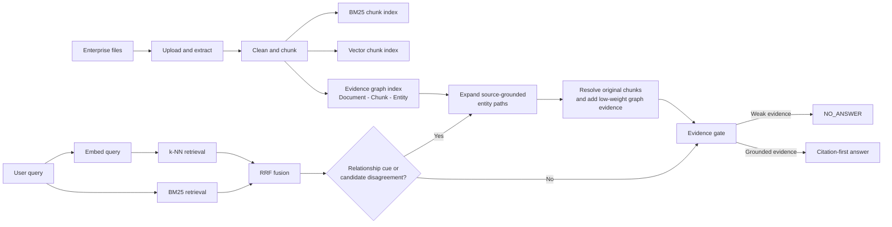
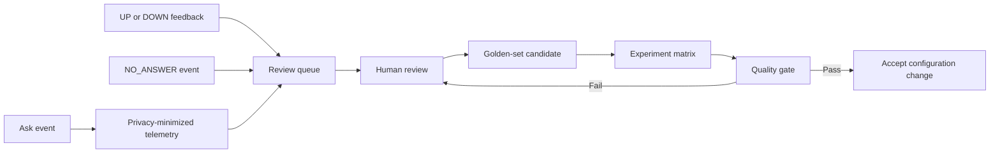

# Evidence-First Graph-Hybrid Architecture

This demo is a focused RAG service for enterprise-file lookup. It intentionally keeps one OpenSearch deployment for text, vector, and source-grounded graph evidence rather than introducing an additional graph database in v1.

## Evidence Responsibilities

- **BM25** handles exact enterprise terms, codes, and policy wording.
- **Vector retrieval** handles paraphrases and semantically similar questions.
- **Evidence graph** handles source-traceable relationships across chunks. It never generates a fact from a graph edge alone.

Graph expansion is conditional. Normal keyword questions avoid graph-query cost when BM25 and vector candidates agree. Relationship-oriented or disagreement queries can expand shared entities, then resolve every graph target back to an original chunk before it can influence ranking.

## Quality Loop

This is controlled improvement, not autonomous model mutation. Feedback and weak-evidence events become reviewable test candidates; a configuration change is accepted only after a comparable experiment passes the regression gate.
